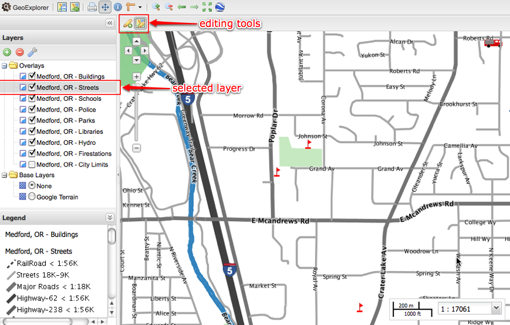
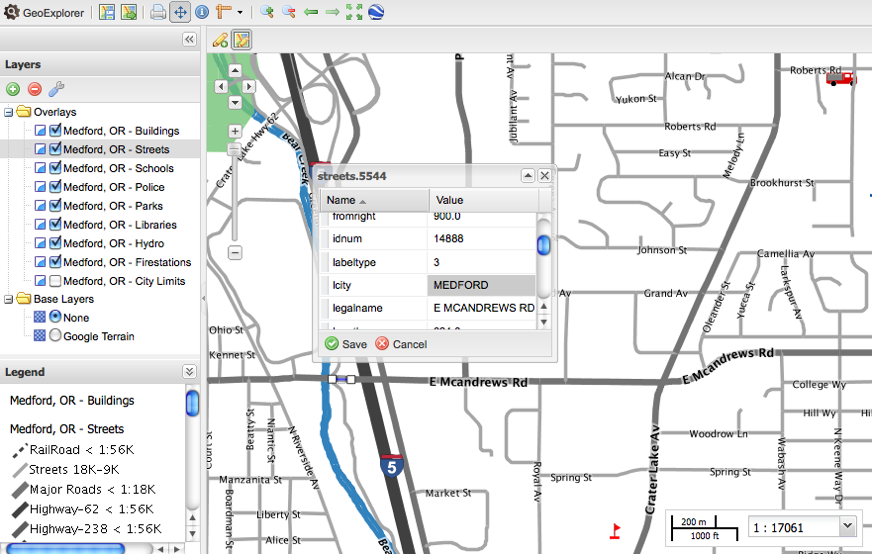

.. _geoexplorer.configuration:

Configuration
=============

This page shows some advanced configuration options for GeoExplorer.

Initial configuration
---------------------

If you want to provide a customized application builder, here is how
to configure it:

The startup WMS or additional WMS servers can be configured by modifying
GeoExplorer/index.html:

.. code-block:: javascript

    wms: {
        "demo": "http://demo.opengeo.org/geoserver/ows/"
    },

"demo" is the key used to reference the WMS in the layer configuration (see
below). More servers can be added easily, e.g. by changing the above to

.. code-block:: javascript

    wms: {
        "demo": "http://demo.opengeo.org/geoserver/ows/",
        "terraserver": "http://terraserver-usa.com/ogccapabilities.ashx"
    },

Two layers will be loaded by default:

 * Global Imagery (topp:bluemarble) as base layer
 * USA Population (topp:states) as overlay

The layers to be loaded at startup can be configured in GeoExplorer/index.html:

.. code-block:: javascript

    map: {
        layers: [{
            name: "topp:bluemarble",
            title: "Global Imagery",
            wms: "demo",
            group: "background"
        }, {
            name: "topp:states",
            wms: "demo",
            visibility: true
        }],
        center: [-96.7, 37.6],
        zoom: 4
    }

The ``name`` property of the layers (e.g. "topp:states" in the above snippet)
are the layer names from the Capabilities document of the
WMS (see
`<http://demo.opengeo.org/geoserver/ows/?SERVICE=WMS&REQUEST=GetCapabilities>`_
for a complete example):

.. code-block:: xml

      <Layer queryable="1">
        <Name>topp:states</Name>
        <Title>USA Population</Title>
        <Abstract>This is some census data on the states.</Abstract>
        <KeywordList>
          <Keyword>census</Keyword>
          <Keyword>united</Keyword>
          <Keyword>boundaries</Keyword>
          <Keyword>state</Keyword>
          <Keyword>states</Keyword>
        </KeywordList>
        <SRS>EPSG:4326</SRS>
        <LatLonBoundingBox minx="-125.30903773" miny="7.705448770000002" maxx="-66.39223326999999" maxy="66.62225323"/>
        <BoundingBox SRS="EPSG:4326" minx="-124.73142200000001" miny="24.955967" maxx="-66.969849" maxy="49.371735"/>
        <Style>
          <Name>population</Name>
          <Title>Population in the United States</Title>
          <Abstract>A sample filter that filters the United States into three
        categories of population, drawn in different colors</Abstract>
          <LegendURL width="20" height="20">
            <Format>image/png</Format>
            <OnlineResource xmlns:xlink="http://www.w3.org/1999/xlink" xlink:type="simple" xlink:href="http://demo.opengeo.org/geoserver/wms/GetLegendGraphic?VERSION=1.0.0&amp;FORMAT=image/png&amp;WIDTH=20&amp;HEIGHT=20&amp;LAYER=topp:states"/>
          </LegendURL>
        </Style>
      </Layer>

The ``title`` property is optional. By default, the title from the
Capabilities document will be used.

The ``wms`` property tells the application on which server to find the layer.
If we would like to add a layer from the "terraserver" WMS that we configured
above, we would simply set ``wms`` to "terraserver".

Layers that should not be visible when loading the application, but shown in
the layer tree, can be configured with the ``visibility`` property set to
false.

Layers with the ``group`` property set to "background" will be base layers.
Only one base layer can be visible at a time.

The ``center`` and ``zoom`` properties are also optional. If not provided,
the map extent will be set to the LatLonBoundingBox specified in the
Capabilities document. For a configuration with more than one layers, the
extent will be taken from the first layer in the "background" group, or the
first layer if there are no layers in the "background" group.

OGC service proxy
-----------------

GeoExplorer will run on any HTTP server, like Apache. All that needs to be
done is unpack GeoExplorer to a web accessible path on your server. There is
only server side requirement: an OGC service proxy. If you have Python
installed, you can use the OpenGeo python proxy, available at:
http://svn.opengeo.org/util/proxy/proxy.py. Information on how to configure
Apache to use that proxy are included in the file.

Adding Editing Capabilities
---------------------------

The following walks through the steps necessary for adding editing capabilities to GeoExplorer. 

	.. note:: Because adding editing to GeoExplorer may require an update of component, parts of the application may be negatively affected. One known issue is the printing component.
	
What you need before starting this tutorial:

* The OpenGeo Suite 2.3.0 or later
* A text editor 

Getting Started
```````````````
.. highlight:: bat

#. Navigate to your suites webapps directory and open :file:`geoexplorer/WEB-INF/narwhal/app/static/index.html` with an editor::

    Windows: %USERPROFILE%\.opengeo\suite\webapps\
    Mac: ~/.opengeo/suite/webapps/
    Linux: ~/.opengeo/suite/webapps/

#. Save the file as :file:`editor.html` in the same directory. Once you've completed the tutorial, you will be able to run editing in GeoExplorer by browsing to http://localhost:8080/geoexplorer/editor.html

	.. note:: We will be adding a new file :file:`editor.html` but you can also modify GeoExplorer's :file:`index.html`. 

Update Resources
````````````````

We will be using Ext JS 3.2.1, OpenLayers 2.10, GeoExt 1.0, and the gxp version used in the FaultedEarth demo at http://gem.demo.opengeo.org/FaultedEarth/.

.. highlight:: xml

Replace the *Ext resources* with the following::

<link rel="stylesheet" type="text/css" href="http://extjs.cachefly.net/ext-3.2.1/resources/css/ext-all.css" />
<link rel="stylesheet" type="text/css" href="http://extjs.cachefly.net/ext-3.2.1/resources/css/xtheme-gray.css" />
<script type="text/javascript" src="http://extjs.cachefly.net/ext-3.2.1/adapter/ext/ext-base.js"></script>
<script type="text/javascript" src="http://extjs.cachefly.net/ext-3.2.1/ext-all.js"></script>

Replace the *OpenLayers resources* with the following::

<link rel="stylesheet" type="text/css" href="http://openlayers.org/api/2.10/theme/default/style.css" />
<script type="text/javascript" src="http://openlayers.org/api/2.10/OpenLayers.js"></script>

Replace the *GeoExt resources* with the following::

<link rel="stylesheet" type="text/css" href="http://api.geoext.org/1.0/resources/css/geoext-all.css" />
<script type="text/javascript" src="http://api.geoext.org/1.0/script/GeoExt.js"></script> 

Replace the *gxp resources* with the following::

<link rel="stylesheet" type="text/css" href="http://gem.demo.opengeo.org/FaultedEarth/theme/gxp/all.css" />
<script type="text/javascript" src="http://gem.demo.opengeo.org/FaultedEarth/script/gxp.js"></script> 


After the linking to resources, our application is configured in a ``<script>`` block. The remaining modifications will be to this block of code. 

Define the Image Path
`````````````````````
.. highlight:: js

Locate the line that defines ``OpenLayers.ImgPath`` and replace it with the following::

	OpenLayers.ImgPath = "http://api.openlayers.org/2.10/img/";

Override Ext and GeoExt classes 
```````````````````````````````
In order to account for Ext API changes, we are using a newer Ext version then the one GeoExplorer for the OpenGeo Suite version 2.3.0 was designed for. To account for API changes, we need to override the previous Ext and GeoExt classes.

At the end of the ``<script>`` block that configures the application, add the following to override Ext prototypes::

	Ext.Toolbar.prototype.height = 27;

Add the following to override GeoExt prototoypes::

	Ext.intercept(GeoExt.Popup.prototype, "initComponent", function() {
	    if (!this.location) {
	        this.location = this.lonlat;
	    };
	});

Add Layer Selection Events
``````````````````````````
Below the classes override, we will add tree panel triggers to the viewer. With he *layerselectionchange* event, selecting a layer tells the editing tool which layer we want to edit.::

	app.on("ready", function() {
	    var tree = Ext.ComponentMgr.all.find(function(c){return c instanceof Ext.tree.TreePanel});
	    tree.on("click", function() {
	        var node = tree.getSelectionModel().getSelectedNode();
	        if (node && node instanceof GeoExt.tree.LayerNode) {
	            app.fireEvent("layerselectionchange", null, app.mapPanel.layers.getByLayer(node.layer));
	        }
	    });
	});


Final Configuration 
```````````````````
In future versions of GeoExplorer, the following will be the only required change. 

Find the line that configures the default source type (``defaultSourceType: "gx_wmssource"``), and add the following tool configuration above it::

	tools: [{
	    ptype: "gx_featuremanager",
	    id: "featuremanager"
	}, {
	    ptype: "gx_featureeditor",
	    toggleGroup: "toolGroup",
	    featureManager: "featuremanager",
	    autoLoadFeatures: true
	}],


Enjoy editing
`````````````
Proceed as normal -- start the Suite, navigate to http://localhost:8080/geoexplorer/editor.html and :ref:`geoexplorer.using.add` layers to your :ref:`geoexplorer.workspace`.  

To use the editing tool, select a layer on the layer tree. If the layer is editable, the two new editing buttons on top of the map will be enabled. 



   *GeoExplorer with an editing component*

The first one is for creating new features, the second for editing existing features. Click one of these buttons. For editing existing features, clicking on a feature will select it. For new features, just start drawing on the map.



   *Editing an existing feature in GeoExplorer*


