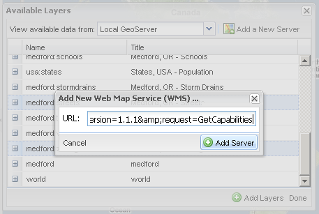
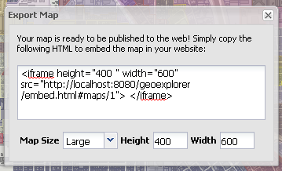
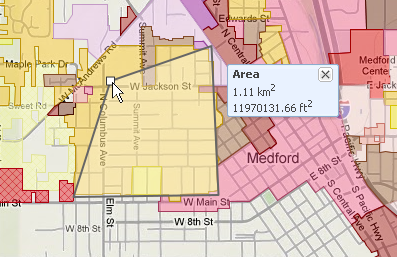
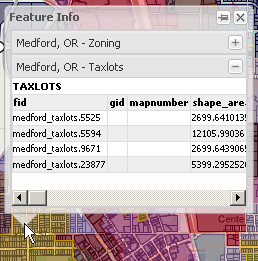

.. _geoexplorer.using:

Using GeoExplorer
=================

The following are the most common tasks accomplished with GeoExplorer.

Adding Layers
-------------

Clicking on the (+) button in the Layers Panel will display the :guilabel:`Available Layers` dialog. The grid lists all layers available on the currently selected WMS server, which by default is the local GeoServer. By clicking on the [+] next to each layer, meta information about the layer will be displayed. Select one or multiple layers and click :guilabel:`Add Layers` to add them to the map.  Click :guilabel:`Done` when finished.

To see layers from a different WMS server, select a server from the :guilabel:`View available data from:` dropdown box.  The available servers are:

    .. list-table::
       :widths: 20 80 

       * - **Local GeoServer**
         - Displays a list of layers from the local GeoServer at http://localhost:8080/geoserver/wms .
       * - **Remote Suite GeoServer**
         - Displays a list of layers from a GeoServer instance on OpenGeo's servers.
       * - **OpenStreetMap Layers**
         - Displays available layers from `OpenStreetMap <http://openstreetmap.org>`_
       * - **Google Layers**
         - Displays available layers from `Google Maps <http://maps.google.com>`_

    .. figure:: images/using_availableservers.png
       :align: center

       *Available server*

You can add a new WMS server by clicking on :guilabel:`Add a New Server`. A small window will pop up, where a WMS service URL can be entered.

.. note:: An example of a WMS URL is http://terraservice.net/ogccapabilities.ashx?version=1.1.1&request=GetCapabilities

   *Adding a new WMS server*

Publishing a Map
----------------

The :guilabel:`Publish Map` wizard will generate an HTML code snippet that will allows the contents of the Map Window to be embedded into any web page or application.  Click the :guilabel:`Publish Map` button in the Toolbar to start the wizard.

A popup will be created that contains HTML code.  You can adjust the size of the embedded map by selecting a size from the dropdown list, or by entering width and height values. 

   *Publishing a map*

Measuring
---------

The :guilabel:`Measure` tool will find the area or length of a section of the map.  When the tool is selected, click on the map to set the initial measure point, then continue clicking to create vertices for the line or polygon. Freehand measuring can be activated by holding the shift key while moving the mouse.  Double click on the map to finish measuring.  The final distance or area will be displayed in a small popup.

   *Measure tool*

Get Feature Info
----------------

The :guilabel:`Get Feature Info` tool will display attributes for all of the features at a given point on the map.  When the tool is selected, click on the map.  A popup will display, showing the attribute information for features in all visible layers at that point.

   *Measure tool*

This information is read-only.  if you would like to edit attribute information, use **GeoEditor**.

