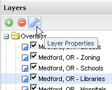
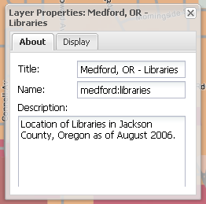
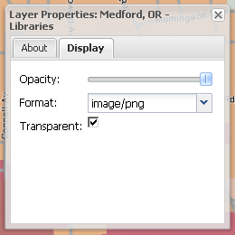

.. _geoexplorer.using.layerproperties:

Layer Properties
================

You can view and edit the properties for a given layer that is loaded in GeoExplorer.

To access the Layer Properties dialog, select a layer by clicking on it in the :ref:`geoexplorer.workspace.layerspanel`, then click the :guilabel:`Layer Properties` button in the Layer Panel toolbar, or right-click and select :guilabel:`Layer Properties` in the context menu.

There are two tabs in the Layer Properties window: :guilabel:`About` and :guilabel:`Display`.

   *Layer Properties button in the Layers Panel toolbar*

About tab
---------

The About tab display textual information about the layer.  The fields displayed are:

    .. list-table::
       :header-rows: 1
       :widths: 30 70

       * - Field
         - Description
       * - **Title**
         - This is the human-readable title associated with the layer.  This field can be edited.
       * - **Name**
         - Internal server name for the layer.  This cannot be edited from within GeoExplorer.
       * - **Description**
         - Also known as Abstract, this field displays a description of the layer.  This field can be edited.

   *About tab in the Layer Properties dialog*

Display tab
-----------

The Display tab shows options related to the rendering of the layer by GeoExplorer.  The fields displayed are:

    .. list-table::
       :header-rows: 1
       :widths: 30 70

       * - Field
         - Description
       * - **Opacity**
         - Determines the level of transparency in the layer.  Default is 100% opaque.  You can adjust opacity by clicking and dragging the slider bar..
       * - **Format**
         - Determines the format of the displayed images.  Can be one of:
            * :guilabel:`image/png` (24-bit PNG) (*Default*)
            * :guilabel:`image/gif` (GIF)
            * :guilabel:`image/jpeg` (JPEG)
            * :guilabel:`image/png8` (8-bit PNG)
       * - **Transparent**
         - Sets transparency for a given layer.  Default is checked.  If this box is unchecked, the layer displays just like a Base Layer, hiding any existing Base Layer.

   *Display tab in the Layer Properties dialog*
